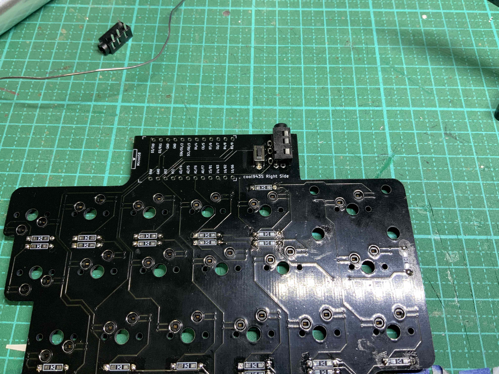

# cool943S　ビルドガイド
## 特徴
 
・cool943Sは、m.kiが設計した40％分割キーボードです。
40％分割キーボードはあまり多く流通していません。自分用に欲しいと思い、これまで自作したcool836A、cool844等得た経験を生かして設計しました 
・入力に必要なキー以外を省略することでコンパクトな形にしました。 
・pro microの配置位置を工夫することで、高さを抑えました。
私はcool943Sを使用する際、パームレストは不要となりました。 
・トップカバープレートにより、pro microに置き換えて、将来的にble microと電池ケースを使用することも構造的に可能となっています。
・ファームウェアは、youichiro氏の開発したREMAPにて、キーレイアウトの編集が簡単にできます。
QMK_FIRMWAREの知識が無くても大丈夫です。 
・サウンドテストの様子 
https://twitter.com/0002ozlet/status/1381212035929665536
 

## 1　部品の確認
次の部品で構成されています。 
１　　PCB　左右それぞれ１枚 
２　　スイッチプレート　左右それぞれ１枚 
３　　トップカバープレート　左右それぞれ１枚 
４　　ミドルプレート　左右それぞれ４枚 
５　　ボトムプレート　左右それぞれ１枚 
６　　チルトプレート　左右それぞれ２枚 
７　　M２ネジ（４ｍｍ８本、８ｍｍ12本） 
８　　M２ナット　６個 
９　　M２スペーサー８ｍｍ六角形タイプ　10個 
１０　Pro micro　２個 
１１　TRRSジャック　２個 
１２　タクトスイッチ　２個 
１３　TRRSケーブル １本 
１４　MXソケット　43個 
１５　ダイオード　43個 
１６　LEDテープ　２枚 
１７　スタビライザー（２Uサイズ）　３個 
１８　キースイッチ　43個 
１９　キーキャップセット　※任意 
２０　USBケーブル（Pro microの端子に準拠したもの） 
２１　ゴム足（クッションゴム、ウレタンパッドなど） 
 
部品のうち、 
１〜６はキットに同封されています。 
７・８・２１はDIY店でも購入可能です。 
９は遊舎工房またはWILCOでネット通販可能です。４のミドルプレートの厚さについてアクリルの精度に課題があり、隙間なく重ねたとき、M２スペーサー８mmがやや出てしまうことがわかりました。気になる方は、M２スペーサー７mm六角形タイプ８個も用意することを勧めます。 
１０〜２１は遊舎工房、TALP KEYBOARDS、KOCHI KEYBOARDで店頭もしくはネット通販で購入可能です。 
これらの部品を、すべてを同封してキット化することできないため、購入者が別途に購入する必要があります。
そのため、私自身が設計、発注した部品１〜６のみ、頒布する形を取りました。
それにより、私自身、部品等を余剰に在庫する必要もなく、購入者自身も選択肢のある部品等を自分の好みで購入することができ、お互いにとって、良い形になると思います。

  

部品の写真（１・２）

部品の写真（３・４・５・６）

## ２　ファームウェアについて
cool943Sはyouichiro氏の開発したREMAPにて、キーレイアウトの編集ができます。 

次の[Hexファイル](https://github.com/telzo2000/cool943S/blob/main/cool943S_via.hex)をダウンロードしてください。そして、QMK TOOLBOXにてPro microへの書き込みをしてください。 
REMAPで作業するための[Jsonファイル](https://github.com/telzo2000/cool943S/blob/main/cool943S_remap.json)はこちらにあります。 
chromeを起動して、「REMAP」と検索し、REMAPのサイトへアクセスしてください。 
（令和3年５月３日追記）REMAPに正式対応しました。
申し込みから承認までの素早い対応に感謝します。 
（追記終了） 

## ３　色塗り
スイッチプレート及びPCBの側面を黒色マジックで塗ってください。cool943Sは側面が黒色アクリルプレートを使用していますので、スイッチプレート及びPCBの側面も同じ黒色のほうが格好良くなります。 
## ４　ダイオードのハンダ付け
ダイオードの足を曲げて取り付けて、ハンダ付けをします。ダイオードの足は、下面から「diode」と印刷された部分の穴に差し込みます。短く切ったマスキングテープで固定してから、裏返して、上面に伸びたダイオードの足は切り離してください。ダイオードには極性があります。ダイオードの黒い帯がある側が「diode」の文字の後ろになるようにハンダ付けしてください。ハンダ付けに自信がない場合、フラックスを利用すると、上手にハンダ付けができます。その後、フラックスクリーナーで綺麗に拭き取ることをお勧めします。 

## ５　MXソケットのハンダ付け
MXソケットをハンダ付けします。ソケットの向きに注意してください。基板にはSocketと書かれています。文字が隠れるようにソケットを置いてください。ソケット両側の端子がPCBと接する方に、予備ハンダをしておくと、ハンダ付けが上手くいきます。上手くハンダ付けができない場合、フラックスを多めに塗布して行うと、ハンダがソケットの端子とPCBの端子の間に流れていきます。その後、フラックスクリーナーで綺麗に拭き取ることをお勧めします。 

## ６　タクトスイッチのハンダ付け
タクトスイッチをPCB上面の「RESET」の印刷が隠れるように差し込んで、下面からハンダ付けをしてください。ここは上・下面を間違えると、後でトッププレートをつける時に、タクトスイッチが干渉します。タクトスイッチは左右それぞれに付けます。 

## ７　TRRSジャックのハンダ付け
TRRSジャックをPCB上面の「TRRS」の印刷が隠れるように差し込んで、下面からハンダ付けをしてください。ここは上・下面を間違えると、後でトッププレートをつける時に、TRRSジャックが干渉します。TRRSジャックは左右それぞれに付けます。 

## ８　LEDテープのハンダ付け
ver.1.1では、LEDテープとPCBの端子部分がややずれています。ダイオードの切り取った足を使ってつなげて対応してください。先にLEDテープの裏紙を剥がしてPCBに貼り付けてから、ハンダ付けをしてください。 
LEDテープの取り付けは任意ですので、光らせることに興味がない場合は、装着しなくてもキーボードとしての機能に問題はありません。しかし、光らないよりは光るほうが、キーボードは格好良く見えます。LEDテープを装着することを推奨します。 

## ９　pro microの取り付け
　本製品ではコンスルー（スプリングピンヘッダ）を使用してのpro microの装着を推奨しています。コンスルー（スプリングピンヘッダ）の向きに気をつけて使用してください。pro microに装着している面が下に向くように（PCBに向くように）してください。pro microは左右それぞれに付けます。
 
## １０　動作確認
ここで一度、動作確認をすることをお勧めます。pro microにファームウェアを入れて、仮にキーキャップをソケットに差し込んで、キースイッチを打鍵した時に反応するかどうか、確認してください。打鍵したけど、入力されない時は、ダイオードの向きが間違っていないか、ソケットのハンダ付けが外れていないか等が原因になります。テスターで導通を確認してください。入力確認には、次のサイトがお勧めです。 
  https://keyboardchecker.com
  

## １１　スタビライザーの取り付け
事前にスタビライザーは、ルブ（グリスを塗布すること）をしておきましょう。ルブしていないと打鍵したときに、かちゃかちゃとした金属音がちょっと残念な気持ちにさせます。 
スタビライザーについては、最近、国内外を問わずに、安価なものから、それなりに良いものまで入手できます。そのため、本キットでも別途、購入としています。ただ、購入する際は、PCBに直付けするタイプのスタビライザーを選んでください。
  

## １２　キースイッチの取り付け
　最初にキースイッチ４個ほどをトッププレートの四隅等４箇所に差し込みます。一度に全部のキースイッチを取り付けて、その後にPCBにハンダ付けしたMXソケットに差し込むとうまくいかないことが予想されます。４箇所で一度PCBにハンダ付けしたMXソケットに差し込み、残りのキースイッチをトッププレート、PCBの順に差し込んでください。それぞれのキースイッチの足がきちんとMXソケットの基板の穴に差し込まれていることを確認してください。差し込むときに、足が曲がってしまうことがあります。その場合は、ボタンを押しても入力されません。一度キースイッチを外して、足の修正または新しいキースイッチに交換等対処してください。  
出来上がったものは、次の作業工程13の④でケースに装着します。 

## 13　ケースの組み立て
最初に、手を石鹸で洗いましょう。その方が手の脂がアクリルに付着啜るのを防げます。次にアクリルの保護紙を剥がしてください。 
①ボトムプレートとチルトプレートを組み立てます。M2ネジ８mmをチルトプレート側から差し込み、反対側ではM2スペーサー８mmで止めます（ここでは緩めに締めてください）。 
②チルトプレートと重ならない箇所（左右それぞれ手前側の２箇所）は、M2ネジ４mmを下面から差し込み、反対側ではM2スペーサー８mmで止めます（ここでも緩めに締めてください）。

③左右それぞれに、ミドルプレート４枚を重ねていきます。ミドルプレートは左右それぞれに、大きさの違うものが２枚ずつあります。見分け方は、左右それぞれに親指がくるあたりの長さが違います。この部分を、例えば、右側のミドルプレートが短いものときは、左側のミドルプレートは長いものとする。次に右側のミドルプレートが長いもののときは、左側のミドルプレートを短いものとする。このように違い違いにしながら、ミドルプレートを重ねていってください。①・②で緩めに締めM2スペーサーの六角形とミドルプレートの六角形の切り抜きとがうまく入るように調整しながら重ねてください。 

④スイッチプレートをケースに装着します。左右それぞれケース手前２箇所は、M2ネジ４mmで締めます。

⑤トップカバープレートを装着します。トップカバープレートは左右長さが違いますので、装着する前に確認してください。
トップカバープレートの上面からM2ネジ８mmを差し込みます。
反対側（トップカバープレートの下面）でM2ナットを通してから、スイッチプレート上面に差し込んでいきます。 
トップカバープレートとスイッチプレートの間に、M2ナットを挟むことで、PCBの上面に差し込まれているpro microがトップカバープレートと接触しないようにしています。 
この構造は将来的に、pro microの代わりに、ble micro（ブルートゥースが使えるpro micro）を使用することを想定しています。
その際、M2ナットの代わりに、必要な高さのM2スペーサーに交換することで、電池ケースまで合わせて装着することができます。 

PCBを収納していない仮組み状態でケースを組み立てもの 

## 14　キーキャップやゴム足の装着
ご希望のキーキャップを装着してください。
本キーボードでは、例えば1.75Uのエンターキーなどはベースセットでそろえられず、40%キットが必要となります。
 
ゴム足は、左右それぞれ４箇所、合計８個必要となります。 
 

## 15 完成
USBケーブル、左右を繋ぐTRRSケーブルを装着して完成となります。 

 
 
